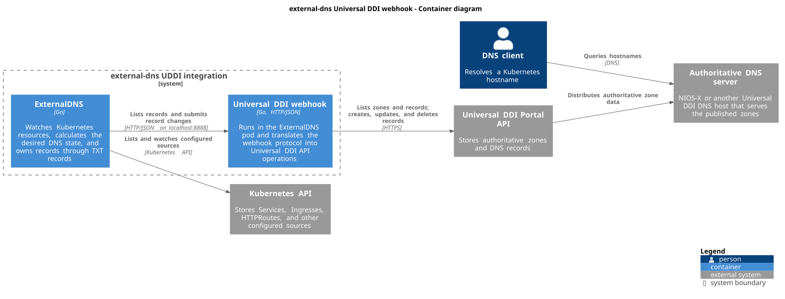
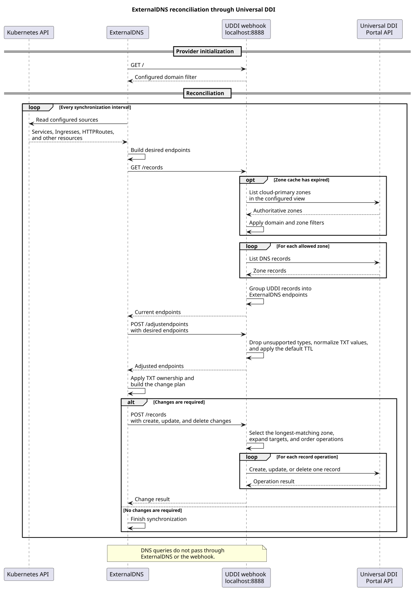
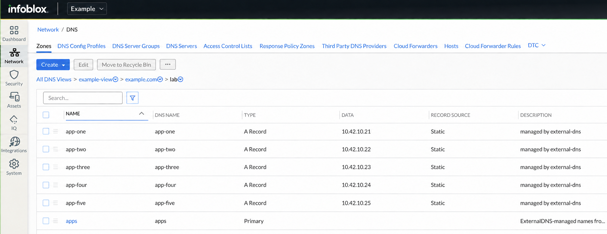

# external-dns-uddi-webhook

[ExternalDNS](https://github.com/kubernetes-sigs/external-dns) webhook provider
for Infoblox Universal DDI, also known as the Infoblox Portal or NIOS-X. Run it
as a sidecar in the ExternalDNS pod to publish Kubernetes hostnames through the
Portal `dns/record` API.

The container image is
`ghcr.io/wayvz-io/external-dns-uddi-webhook`. Releases publish the `vX.Y.Z`,
`vX.Y`, and `latest` tags for `linux/amd64` and `linux/arm64`.

## How it fits together

ExternalDNS reads Services, Ingresses, HTTPRoutes, and the other configured
Kubernetes sources. The webhook runs beside ExternalDNS in the same pod and
translates the webhook protocol into Universal DDI API requests.



*ExternalDNS and the webhook manage records through the Portal API. DNS clients
query the authoritative DNS servers directly. [PlantUML source](docs/diagrams/container.puml).*

## How changes flow

ExternalDNS owns the reconciliation loop. The webhook reads the current
Universal DDI records, adjusts desired endpoints for provider rules, and
applies the change plan that ExternalDNS sends.



*The webhook API stays on localhost inside the pod. [PlantUML source](docs/diagrams/reconciliation.puml).*

Each DNS target is one UDDI record. The provider adds the
`external-dns=true` Portal tag, but the ExternalDNS TXT registry determines
ownership. Use a different `txtOwnerId` for each ExternalDNS installation.

See [Design](docs/DESIGN.md) for zone selection, record mapping, TXT
normalization, and TTL behavior.

## What the records look like in Universal DDI



*The Portal shows each DNS target as a record and labels it with the configured
`managed by external-dns` comment. The data in this screenshot has been
anonymised.*

## Before you deploy

Prepare these resources first:

- A UDDI DNS view and a `cloud` primary authoritative zone.
- An API key with DNS data read and write access to that view.
- Delegation or forwarding from your resolvers to the NIOS-X servers for the
  zone.
- A Kubernetes Secret named `uddi-api-key` with the API key in `api_key`.
- The Gateway API CRDs if you enable the `gateway-httproute` source shown
  below.

Keep the ExternalDNS `domainFilters` value and the sidecar `DOMAIN_FILTER`
value the same. The first filter limits which Kubernetes endpoints ExternalDNS
considers. The second limits the zones and records exposed by the sidecar.

## Deploy with the ExternalDNS Helm chart

Create the namespace and Secret. Replace `/path/to/portal-key` with a file that
contains only the API key:

```sh
kubectl create namespace external-dns
kubectl -n external-dns create secret generic uddi-api-key \
	--from-file=api_key=/path/to/portal-key
```

Save the following values as `values.yaml`. Replace the view, domain, owner ID,
and image tag for your environment.

```yaml
image:
  tag: v0.22.0

provider:
  name: webhook
  webhook:
    image:
      repository: ghcr.io/wayvz-io/external-dns-uddi-webhook
      tag: v0.2.0
    env:
      - name: INFOBLOX_PORTAL_KEY
        valueFrom:
          secretKeyRef:
            name: uddi-api-key
            key: api_key
      - name: UDDI_VIEW
        value: my-view
      - name: DOMAIN_FILTER
        value: k8s.example.com
    securityContext:
      runAsNonRoot: true
      readOnlyRootFilesystem: true
      capabilities:
        drop: ["ALL"]

sources: [service, ingress, gateway-httproute]
registry: txt
txtOwnerId: my-cluster
txtPrefix: "reg-%{record_type}."
domainFilters: [k8s.example.com]
policy: sync
interval: 1m
```

The record-type placeholder in `txtPrefix` prevents a registry TXT record from
colliding with a CNAME at the same name. With `policy: sync`, ExternalDNS also
deletes records owned by `my-cluster` when their Kubernetes source disappears.

Install the upstream chart:

```sh
helm repo add external-dns https://kubernetes-sigs.github.io/external-dns/
helm repo update
helm upgrade --install external-dns external-dns/external-dns \
	--namespace external-dns \
	--values values.yaml
```

The chart sends webhook traffic to port 8888 inside the pod and probes
`/healthz` on port 8080. The webhook API is not exposed outside the pod.

## Publish a hostname

ExternalDNS publishes hostnames from the sources selected in `values.yaml`.
For example, add its hostname annotation to a LoadBalancer Service:

```yaml
apiVersion: v1
kind: Service
metadata:
  name: example
  annotations:
    external-dns.alpha.kubernetes.io/hostname: app.k8s.example.com
spec:
  type: LoadBalancer
  selector:
    app.kubernetes.io/name: example
  ports:
    - port: 80
      targetPort: 8080
```

After the Service receives a load-balancer address, ExternalDNS sends the
hostname and address to the sidecar. Check both containers and then query the
authoritative DNS path:

```sh
kubectl -n external-dns rollout status deployment/external-dns
kubectl -n external-dns logs deployment/external-dns -c external-dns
kubectl -n external-dns logs deployment/external-dns -c webhook
dig +short app.k8s.example.com
```

The [`deploy/kustomize`](deploy/kustomize) directory contains equivalent raw
manifests. It expects the same `uddi-api-key` Secret and does not prescribe a
secret manager.

## Configuration

| Variable | Default | Purpose |
|---|---|---|
| `INFOBLOX_PORTAL_KEY` | required | Portal API key with DNS data read and write access to the view |
| `INFOBLOX_PORTAL_URL` | `https://csp.infoblox.com` | Portal base URL |
| `UDDI_VIEW` | `default` | DNS view name. The webhook resolves it to an ID at startup. |
| `UDDI_ZONE_FILTER` | empty | Comma-separated zone FQDNs that the webhook may list and write |
| `UDDI_ZONE_CACHE_TTL` | `5m` | How long the webhook caches the zone list |
| `UDDI_PAGE_LIMIT` | `1000` | Page size for Portal list requests, from 1 through 10000 |
| `UDDI_DEFAULT_TTL` | `0` | TTL for endpoints without one. Zero inherits the zone default. |
| `UDDI_RECORD_COMMENT` | `managed by external-dns` | Comment added to managed records |
| `UDDI_TAGS` | `external-dns=true` | Comma-separated `key=value` tags added to managed records |
| `DOMAIN_FILTER` | empty | Comma-separated domains included by the webhook and returned from `GET /` |
| `EXCLUDE_DOMAIN_FILTER` | empty | Comma-separated domains excluded by the webhook |
| `REGEXP_DOMAIN_FILTER` | empty | Regular expression that selects domains |
| `REGEXP_DOMAIN_FILTER_EXCLUSION` | empty | Regular expression that excludes domains |
| `SERVER_HOST` | `localhost` | Webhook API host. Keep this listener on localhost. |
| `SERVER_PORT` | `8888` | Webhook API port |
| `SERVER_READ_TIMEOUT` | `5s` | Webhook API read timeout |
| `SERVER_WRITE_TIMEOUT` | `10s` | Webhook API write timeout |
| `HEALTHZ_HOST` | `0.0.0.0` | Health and metrics host |
| `HEALTHZ_PORT` | `8080` | Port for `/healthz`, `/readyz`, and `/metrics` |
| `DRY_RUN` | `false` | Log record changes without applying them |
| `LOG_LEVEL` | `info` | Log level: `debug`, `info`, `warn`, or `error` |
| `LOG_FORMAT` | `json` | Log format: `json` or `text` |

Regular-expression filters take precedence over the plain include and exclude
lists. `UDDI_ZONE_FILTER` adds another boundary: the provider never lists or
writes a zone outside that list.

The provider manages A, AAAA, CNAME, TXT, SRV, MX, and NS records. An endpoint
TTL or `UDDI_DEFAULT_TTL` overrides the zone default. Records without either
value inherit the zone default.

## Development and security

See the [contribution guide](CONTRIBUTING.md) to build and test changes, and the
[security policy](SECURITY.md) to report a vulnerability.

## Licence

Apache-2.0. See [LICENSE](LICENSE) and [NOTICE](NOTICE).
