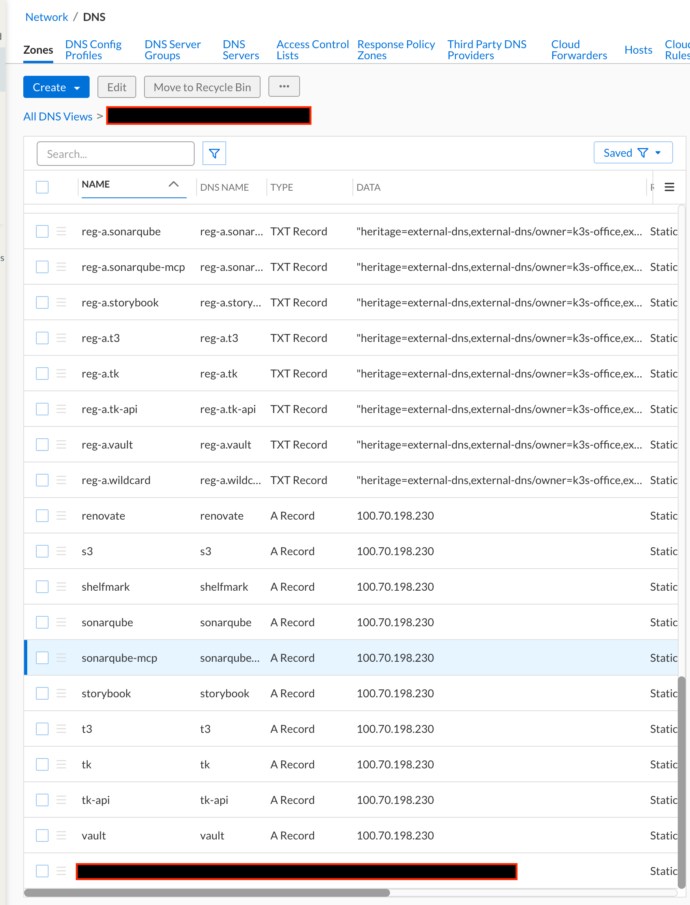

# external-dns-uddi-webhook

[ExternalDNS](https://github.com/kubernetes-sigs/external-dns) webhook provider
for **Infoblox Universal DDI** (the Infoblox Portal / NIOS-X). Runs as a sidecar
next to `external-dns` and turns its record changes into Portal `dns/record`
calls. Static Go binary on distroless, multi-arch.

Image: `ghcr.io/wayvz-io/external-dns-uddi-webhook` (tags `vX.Y.Z`, `vX.Y`, `latest`; linux/amd64 + linux/arm64)

## Configuration (environment)

| Variable | Default | Purpose |
|---|---|---|
| `INFOBLOX_PORTAL_KEY` | required | Portal API key (DNS data read/write on the view) |
| `INFOBLOX_PORTAL_URL` | `https://csp.infoblox.com` | Portal base URL |
| `UDDI_VIEW` | required | DNS view **name**; resolved to its id at startup |
| `UDDI_ZONE_FILTER` | | Optional comma list of zone FQDNs; when set, only these zones are listed or written |
| `DOMAIN_FILTER` | | Comma list of domains; also returned to external-dns on `GET /` |
| `EXCLUDE_DOMAIN_FILTER` | | Domains to exclude |
| `REGEXP_DOMAIN_FILTER` / `REGEXP_DOMAIN_FILTER_EXCLUSION` | | Regex variants |
| `SERVER_HOST` / `SERVER_PORT` | `localhost` / `8888` | Webhook API (keep on localhost) |
| `HEALTHZ_HOST` / `HEALTHZ_PORT` | `0.0.0.0` / `8080` | `/healthz` and `/metrics` |
| `DRY_RUN` | `false` | Log changes instead of applying them |
| `LOG_LEVEL` | `info` | `debug`, `info`, `warn`, `error` |

Record types: A, AAAA, CNAME, TXT, SRV, MX, NS. Records are tagged
`external-dns=true` in the Portal; ownership is the ExternalDNS TXT registry.
An explicit TTL (annotation or `UDDI_DEFAULT_TTL`) is written as an override of
the zone default; without one the record inherits it.

## Deploy with the upstream Helm chart

```yaml
provider:
  name: webhook
  webhook:
    image:
      repository: ghcr.io/wayvz-io/external-dns-uddi-webhook
      tag: v0.1.0
    env:
      - name: INFOBLOX_PORTAL_KEY
        valueFrom:
          secretKeyRef:
            name: uddi-api-key
            key: api_key
      - name: UDDI_VIEW
        value: my-view
      - name: DOMAIN_FILTER
        value: k8s.example.com
    securityContext:
      runAsNonRoot: true
      readOnlyRootFilesystem: true
      capabilities: { drop: ["ALL"] }
sources: [service, ingress, gateway-httproute]
registry: txt
txtOwnerId: my-cluster
txtPrefix: "reg-%{record_type}."
domainFilters: [k8s.example.com]
policy: sync
interval: 1m
```

The chart already probes `/healthz` on port 8080 of the `webhook` container.
`deploy/kustomize/` has the equivalent raw manifests as a reviewable example.

## What it looks like

Records as the provider creates them, in the Infoblox Portal. Each hostname gets
its address record, and the ExternalDNS TXT registry records sit alongside under
the record-type-aware prefix, which is what marks them as owned and keeps the
provider off anything it did not create.



## Development

See [docs/DEVELOPMENT.md](docs/DEVELOPMENT.md) for building, testing, and
releasing this project.

## Licence

Apache-2.0. See [LICENSE](LICENSE) and [NOTICE](NOTICE).

Apache-2.0 rather than MIT to match the ecosystem this plugs into (ExternalDNS,
the Infoblox Go client and the Prometheus client are all Apache-2.0) and for
its express patent grant, which matters for a project whose whole purpose is
interoperating with a commercial vendor API.
